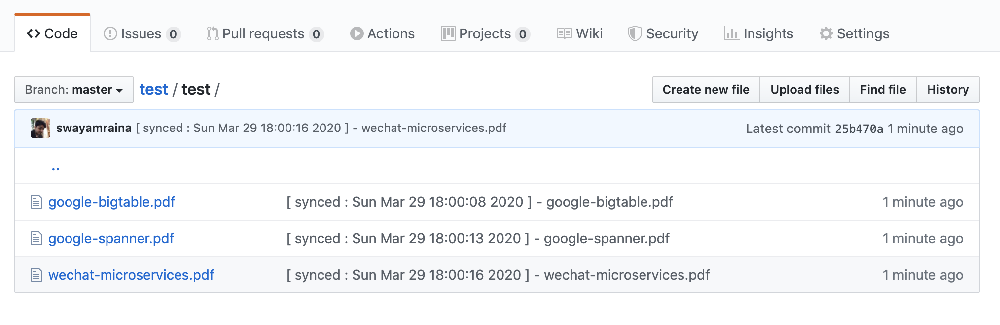

<br>

## What is fcd ?

**fcd** was inspired by my previous project `flash-card` and service like `Dropbox`. <br>
fcd is nothing but a daemon process which syncs all files in a directory with a remote 
directory so that you can get your important docs even if you switch your hardware (laptops).

Simply put this is yet another dev-tool which solves one of my problem.


<br>

## Why did I build this ?

During my time at Airtel X Labs, I was introduced to [Hacker News](https://news.ycombinator.com/news)
by one of my colleague and I really thank him as he has influenced me a lot and shaped me to be 
the kind of developer I am today. 

Back to answering the question, to keep all the best articles I read on HN in one place, 
I created a Google chrome extension which would save all my favourite articles for me. 
You can say somewhat similar to Pocket. One issue with `flash-card` was it could only save 
links to the web pages and not the document itself. <br> 
Also at the same time, I had been maintaining my collection of research papers, white papers, 
books etc by downloading them and keeping them in a separate folder. 
So when I made a switch from Airtel X Labs to Swiggy, I had to upload all of them to Google 
drive and sync when I got a new mac in Swiggy.

I was happy with everything working fine. Soon, my mac crashed (just after I gave an internal
talk on Redis in Swiggy) and all of my data went poof! 

This could have been prevented if I had regularly kept everything in sync or used Dropbox or 
Google drive's local setup.    

Since Google and Dropbox have a very strict memory usage limits which did not suit my use-case 
and I also had nothing much to do during this covid lock-down situation, I decided to write my 
own daemon application which would keep everything in-sync for me.   


<br>

## How to setup ?

The daemon basically needs a few data points before it can start. The daemon is configured to
read a [YAML](https://en.wikipedia.org/wiki/YAML) file containing all the user data and start 
the sync process.

Here is a sample yaml config file,

```yaml
git_config:
   access_token: "xxxxxxxxxx"
   repo: "flash-drive"
   username: "flash"
   email: "flash@dc.com"

refresh_config:
   refresh_interval: 30
   refresh_unit: m

search_locations:
   - /Users/flash/Desktop/comics/
   - /Users/flash/Desktop/secret-plans/
```  

<br>

How to actually setup?

1. [**Generate**](https://github.com/settings/tokens) an access token on github. 
2. Define your config file (see above mentioned sample file) 
3. Save this file locally 
4. Download the setup script using the below command <br>
  ***`curl -O https://raw.githubusercontent.com/swayamraina/fcd/master/setup.sh`*** 
5. Run the setup script using this command ***`sh setup.sh`***  
5. Done, It's this simple!

<br>

After some time of use, your learning repository should look like this,



<br>

## Where to go from here ?

* Found a bug? <br>
  You can either report it by mailing me on `swayamraina@gmail.com` or simply raise an issue here

* Want to contribute? <br>
  You can always raise PRs and add features that you feel will help everyone else.
  
* What's next?  <br>
  I will be revamping the **flash-card project** and open-sourcing that too.


